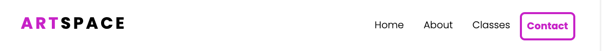

# ARTSPACE - Project Portfolio 1 - HTML & CSS

ARTSPACE is a landing page which aims to provide information to Parents of children wanting to pursue art and crafts classes. Artspace offers just that, a space to create Art in a friendly environment to children of all ages.
Artspace provides information to its users who want to find out about the different art classes, age categories and contact information.
 
Link to Live website here -  <a href="https://chasingash.github.io/kids-art-classes/" target="_blank" rel="noopener">Artspace</a>
 
 

# Objective

For my first project, I will provide a professionally developed responsive website for users to find out about art classes for their children. The main objective is to demonstrate competency in HTML and CSS. It is my intention to create a static front end application demonstrating a clear purpose which is easy to navigate across all devices.

# User Experience (UX)

## Design Prototype
I designed a prototype for ARTSPACE on paper first and then moved into Balsamiq _link to official site here) where I created numerous wireframes to fit mobile, tablet and desktop devices which provided me with a clear visual outline of how I wanted my site to appear. Some changes were made along the development stage as I experimented with different layouts to suit the needs of the site and also from further research into UX design.
 

## Site Structure

The website ARTSPACE is a one-page website, with 4 navigation links and a clear call to action button centered in the middle of the hero section. The Homepage is the default loading page with a fully responsive navigation bar which has links to the subsequent sections, - About, Classes and Contact.

# Design

* ## Typography
 
The fonts I picked are Playfair Display and Poppins which I implemented into the CSS file via Google fonts.
Primary Font - Playfair Display -  chosen for its traditional style. Well suited for titling and headlines.
Secondary Font - Poppins - Chosen as the secondary font for its fun, modern and fresh feel and to balance out my primary font.

* ## Colour Scheme
 
I went for a clean and fresh colour scheme inspired by this year's Pantone colour of the year, 17-3938 Very Peri ( Link colour to - https://www.primoprint.com/blog/pantones-color-of-the-year-2022/ ) which is in good contrast to my chosen background hero image.
As quoted on their site  "From a psychological standpoint, purple represents spirituality, wisdom, and bravery. It tends to make people feel mysterious and imaginative."

* ## Imagery

All imagery was sourced from the website, pexel.com - link site :)

# Features

The ARTSPACE website is set up for easy navigation. It contains a navigation bar, a highlighted contact button when hovered over it flips colour and a call to action button centered in the middle, clearly stating “Find a class” which the user is there to do. The overall feel of the site is intended to be inviting while encouraging the user to explore more. I designed this site with mobile first in mind.

## Existing Features
 
* ### Navigation bar

Located at the top of the website, it allows its users to intuitively navigate the site. It is fully responsive and contains all links to all sections of the site. It is in a fixed position so that it stays visible, whether you scroll down through the page or use the convenient links nested inside the bar. In mobile view, there is a hamburger icon which also has a fixed position and working links.
 
The LOGO is clickable and links back to the homepage.

Desktop Navigation Bar - Image</b>

* ### Homepage section
 
The homepage has a background image which fits the screen. The image is colourful and playful and gives a good clear direction of what the website is about. This is where the user lands on their initial visit. It is designed to be intuitive and user friendly.
 
 
Overlaid on top of the image is where the main header text appears. It states clearly in large text what the site is about.
 
Above the main header text, is more text in slightly smaller text and in uppercase with a catchy slogan to further draw in the user.
 
Beneath the Main text is a simple yet effective call-to-action button that directs the user to “Find a class”
 
Insert screenshot of Full screen - nav and hero section :)

* ### About section

The About section gives a clear and concise description of what Artspace is about and its offerings.
Insert screenshot here :)

### Classes section

The Classes section aims to provide the user with the age category, a class description and the day and times for each art class.
Insert screenshot here :)
