# ARTSPACE - Project Portfolio 1 - HTML & CSS

ARTSPACE is a landing page which aims to provide information to Parents of children wanting to pursue art and crafts classes. Artspace offers just that, a space to create Art in a friendly environment to children of all ages.
Artspace provides information to its users who want to find out about the different art classes, age categories and contact information.
 
Link to Live website here -  <a href="https://chasingash.github.io/kids-art-classes/" target="_blank" rel="noopener">Artspace</a>
 
 
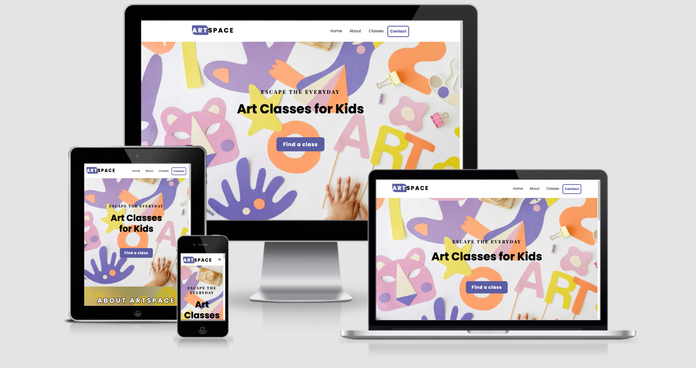

# Objective

For my first project, I will provide a professionally developed responsive website for users to find out about art classes for their children. The main objective is to demonstrate competency in HTML and CSS. It is my intention to create a static front end application demonstrating a clear purpose which is easy to navigate across all devices.

# User Experience (UX)
## Target Audience
  * Parents to kids of all ages looking to pursue various art classes.

## User Stories
  * As a first time vistor to the site, the user wants to navigate the site intuitively and to determine its purpose immediately.
  * The user wants to know where to locate information about upcoming classes. 
  * The user wants to be able to easily contact the owner. 
  * The user wants to be able to access the social media accounts.

## Design Prototype
I designed a prototype for ARTSPACE on paper first and then moved into Balsamiq where I created numerous wireframes to fit mobile, tablet and desktop devices which provided me with a clear visual outline of how I wanted my site to appear. Some changes were made along the development stage as I experimented with different layouts to suit the needs of the site and also from further research into UX design.
 
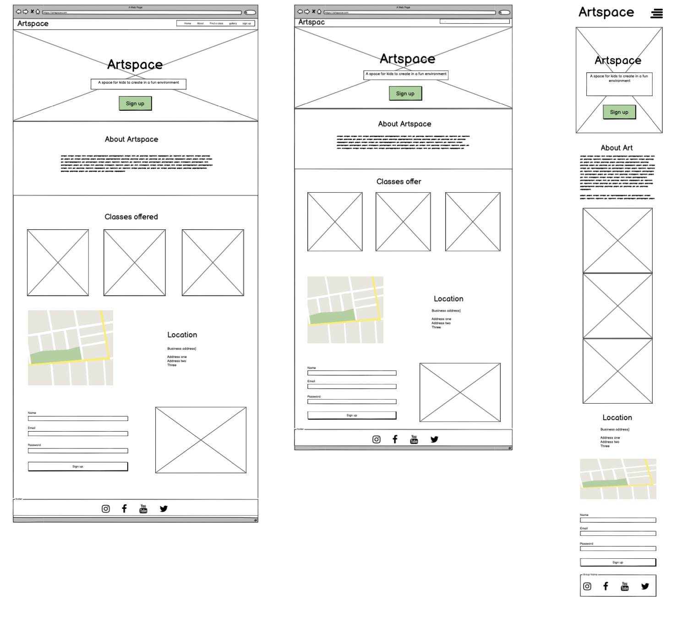

## Site Structure

The website ARTSPACE is a one-page website, with 4 navigation links and a clear call to action button centered in the middle of the hero section. The Homepage is the default loading page with a fully responsive navigation bar which has links to the subsequent sections, - About, Classes and Contact.

# Design

* ## Typography
 
The fonts I picked are Playfair Display and Poppins which I implemented into the CSS file via Google fonts.
* Primary Font - Poppins. Chosen for its fun, modern and fresh feel.
* Secondary Font - Playfair Display. Chosen for its traditional style. Well suited for sub-titling and complements the primary font.

* ## Colour Scheme
 
I went for a clean and fresh colour scheme inspired by this year's Pantone colour of the year, 17-3938 Very Peri ( Link colour to - https://www.primoprint.com/blog/pantones-color-of-the-year-2022/ ) which is in good contrast to my chosen background hero image.
As quoted on their site  "From a psychological standpoint, purple represents spirituality, wisdom, and bravery. It tends to make people feel mysterious and imaginative."

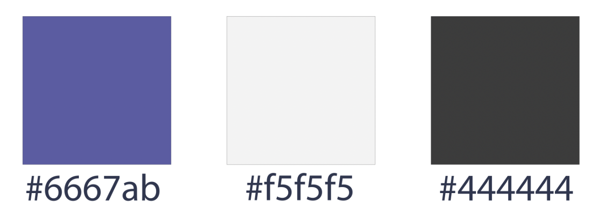

* ## Imagery

All imagery was sourced from the website, pexel.com - link site :)

# Features

The ARTSPACE website is set up for easy navigation. It contains a navigation bar, a highlighted contact button when hovered over it flips colour and a call to action button centered in the middle, clearly stating “Find a class” which the user is there to do. The overall feel of the site is intended to be inviting while encouraging the user to explore more. I designed this site with mobile first in mind.

## Existing Features
 
* ### Navigation bar

Located at the top of the website, it allows its users to intuitively navigate the site. It is fully responsive and contains all links to all sections of the site. It is in a fixed position so that it stays visible, whether you scroll down through the page or use the convenient links nested inside the bar. In mobile view, there is a hamburger icon which also has a fixed position and working links.
 
The LOGO is clickable and links back to the homepage. I created it using fonts and css styling. 

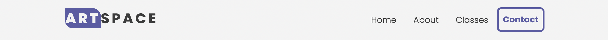

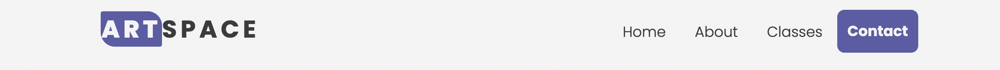

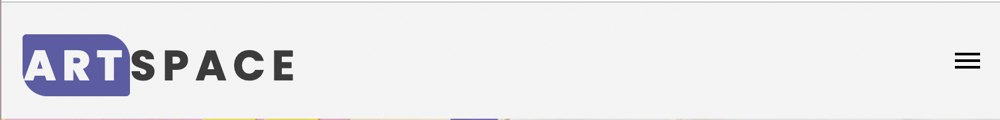

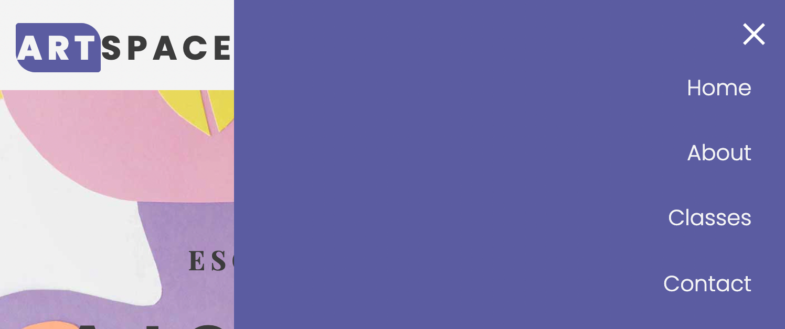

* ### Homepage section
 
 The homepage has a background image which fits the screen. The image is colourful and playful and gives a good clear direction of what the website is about. This is where the user lands on their initial visit. It is designed to be intuitive and user friendly.
 
 Overlaid on top of the image is where the main header text appears. It states clearly in large text what the site is about.
 
 Above the main header text, is more text in slightly smaller text and in uppercase with a catchy slogan to further draw in the user.
 
 Beneath the Main text is a simple yet effective call-to-action button that directs the user to “Find a class”
 

* ### About Section

 The About section gives a clear and concise description of what Artspace is about and its offerings.

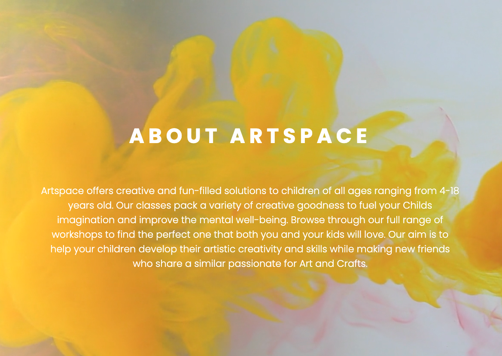

* ### Class Information Section

  The Class information section aims to provide the user with the age category, a class description and the day and times for each art class.

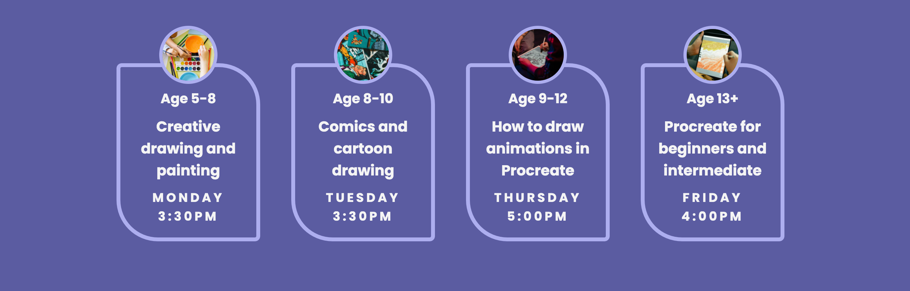

* ### Contact Section

  The contact form allows for enquiries about its currently run art classes to be sent to the creator.

  The contact section is fully responsive and aligns above the map in mobile view. In larger screens it aligns to the left of the map.

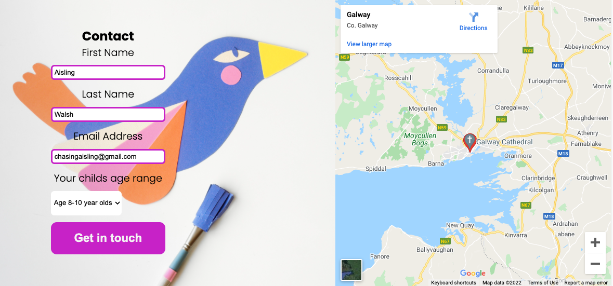

* ### Footer Section

  The Footer contains the social media links. The links open in new individual  tabs. For educational purposes only and open to their respective homepages.

# Future Implementation

* A newsletter with future upcoming classes. 
* A monthly blog with art tips and techniques.
* User Testimonials.
* An LMS with tutorials to cater for those that don’t live close by.
* An ecommerce shop selling art supplies. 
* Create a Favicon.

# Technologies Used

* [HTML5](https://en.wikipedia.org/wiki/HTML) - to provide content and structure for the website.
* [CSS3](https://en.wikipedia.org/wiki/CSS) - for styling the website. 
* [JavaScript](https://en.wikipedia.org/wiki/JavaScript) -  to enable responsiveness for mobile navigation.
* [Balsamiq](https://balsamiq.com/) - to create the wireframes.
* [Photoshop](https://www.adobe.com) -  used to compress the images.
* [Pantone](https://www.pantone.com) -  to select the the proper hex code for this years colour of the year and complimentary colours. 
* [Font Awesome](https://www.fontawesome.com/) - for social media icons.
* [Gitpod](https://www.gitpod.io/) - Used to develop the website.
* [Github](https://www.github.com) - for hosting and deployment.
* [GitBash](https://en.wikipedia.org/wiki/Bash_(Unix_shell)) - Terminal used to push changes to GitHub repository.

# Testing

* ## Code Validation

* The Artspace website has been tested and validated by both the W3C HTML Validator and the W3C CSS Validator. All minor erros found were fixed immediately. 

* ### HTML Validation Image

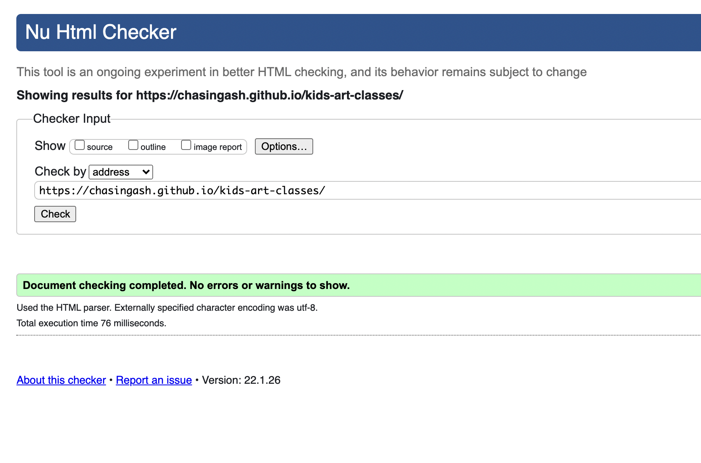

* ### CSS Validation Image

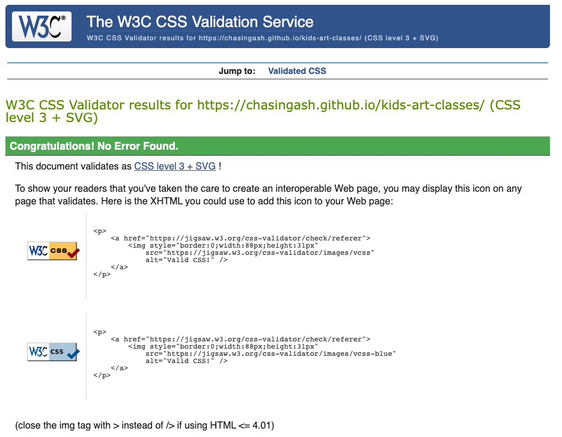

* ## Lighthouse Testing

* The Website has been put through the Chrome Dev Tools which tests for the following:
  * Performance - page preformance on loading.
  * Accessibility - ensuring accessibility for all users and how it can be improved.
  * Best Practices - Examining whether the site conforms to industry best practices. 
  * SEO - Which stands for Search Engine Optimisation. Is the site optimised for search engine result ranking.

* ### Chrome Desktop Lighthouse result
  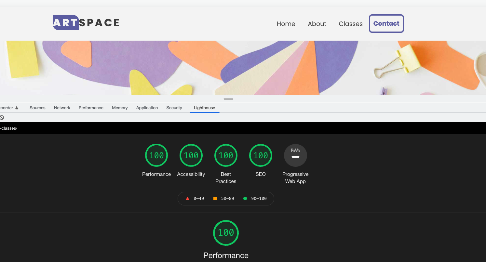

* ### Chrome Mobile Lighthouse Result
  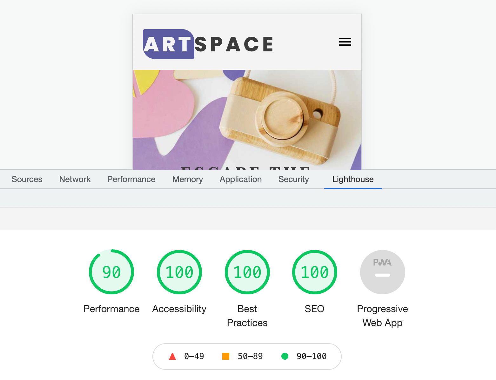

* ## Accessibility Testing
* Ran Website through a11y to test colour contrast and found no issues. 
  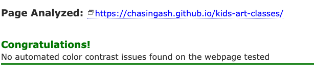
  
* ## Responsive Testing
  * Google Chrome DevTools and Responsive Design Checker were used to test the responsiveness  of the website. 

* # Manual Testing
  * To ensure that everything was working properly and up to a professional startard, I conducted a number of manual tests.

  * ## Tests Conducted
    * Navigation Menu
      * Ensure that upon clicking, the Logo navgates back to the top of page.
      * Ensure that all links to the different sections are funtioning as intended.
      * Ensure that all hover effects are consistent on all buttons.
      * Ensure that the navigation bar is fully responsive. 
      * Ensure that when clicked, all navigation links scroll smoothly to their correct section of the page.
      * Ensure that the hamburger menu is fully funtional when clicked. 
      * Ensure that the navigation is fixed in position upon scrolling down and when navigation links are selected.
      * Ensure the contact button has a hover effect. 

    * Home/Landing Section
      * Ensure the Hero image is not pixelated and fully responsive across all devices. 
      * Ensure that all elements are fully responsive.
      * Ensure that the main text, sub-text and call to action button are central to the page and responsive.
      * Ensure all images are optimished and have alt functions.
      * Ensure that when clicked, the call to action button takes the suer to the class information section.
      * Ensure the call to action button has a hover effect. 

    * About Section
      * Ensure text is presented clearly with the correct font style and sizing. 
      * Ensure text is revised and checked for any spelling errors that might have occured in teh development phase.
      * Ensure the About section is fully responsive across all devices.

    * Class Information Section
      * Ensure that all elements are aligned properly and centered.
      * Ensure that all elements are fully responsive.
  
    * Contact section
      * Ensure that all elements that are set to required are working properly.
      * Ensure that the "submit" button lets the user know that the submission was successful.
      * Ensure the contact section is fully responsive.
  
    * Footer Section
      * Ensure that all social links open in a new tab.
      * Ensure the footer is fully responsive. 

* ## Bug Fixes

After testing the site on different screen sizes, i discovered some text was not aligned properly which on further investigation appeared to be due to margin and padding issues. 

I resolved with media queries and ajusting the margin and padding. 

Another issue i had was with the navigation links not stopping at the right section and catching the fixed navigation bar to cut some of the section of. 

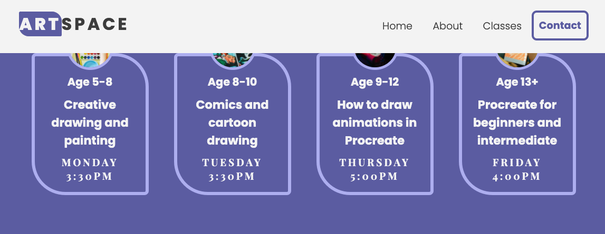

I resolved this by wrapping the container inside a span element and giving it a unique ID. The i added a relative position to it in css which fixed the issue. 

 # Deployment
  ### **Project Deployment steps**
  The follwing steps were taken to deploy my website to GitHub pages. 
  1. In the GitHub repository, navigate to the **Settings** tab.
  2. In settings, scroll down to the **Pages** tab.
  3. Next, select the branch **main** under **Source** and click **save**.
  4. Finally, the page should automatically refresh, making the deployed link visible.

The live link can be found <a href="https://chasingash.github.io/kids-art-classes/" target="_blank" rel="noopener">Here</a>

 # Credits
 ## Content
 * Font from Google fonts
 * Icons from Font Awesome
 * JavaScript code used to create the responsive navigation bar https://youtu.be/D-h8L5hgW-w
 * All other code used as inspiration, I added with comments to the css file.
 * W3schools

## Media
* All images and video were sourced from Pexels.com
* All images compressed using Adobe Photoshop

* # Acknowledgments

I would like to thank the slack community, my mentor and all at the Code Institute for their continued help and support throughout this whole process and to Mike who provided the layout i used to create this readme file.

